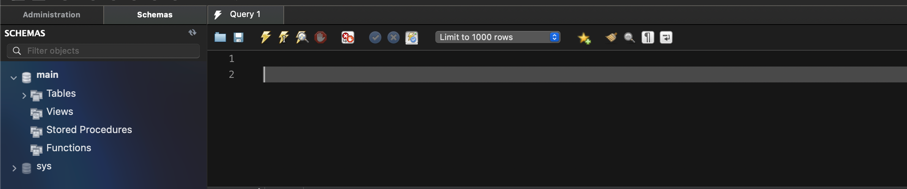

# ELEC5619-Project

# Used Libraries:
Front-End:
1. axios@1.5.0
2. bootstrap@5.3.1
3. react-bootstrap@2.8.0
4. react-calendar@4.6.0
5. react-datepicker@4.1.1
6. react-dom@18.2.0
7. react-router-dom@6.15.0
8. react-scripts@5.0.1
9. react@18.2.0
10. stripe@14.1.0
11. @stripe/react-stripe-js@2.3.1
12. @stripe/stripe-js@2.1.9
13. @testing-library/jest-dom@5.17.0
14. @testing-library/react@13.4.0
15. @testing-library/user-event@13.5.0

Back-End:
1. com.twilio.sdk:twilio:8.21.0
2. org.springframework.boot
3. javax.servlet:javax.servlet-api:4.0.1
4. io.jsonwebtoken
5. com.mysql:mysql-connector-j:8.0.32
6. com.stripe:stripe-java:23.9.0
7. org.webjars.npm:jsonwebtoken:8.5.1
8. org.projectlombok:lombok

# Working functionalities:
Elderly User:
1. Sign Up
2. Select Subscription
3. View Services
4. Select Service
5. Subscriptions Business Logic
6. Notifications
7. Cancel Service Request
8. Rate Service Request
9. Report Service Request
10. Profile
11. Email and SMS notifications
12. Unsubscribe

Provider User:
1. Sign Up
2. Edit Personal Information
3. Select Services
4. Accept Service Requests
5. View User Information
6. Payment Account Setup
7. Manage Notifications
8. Modify Profile Photo and Information

Admin User:
1. View User List
2. Deactivate Users
3. Manage Payments
4. View Reported Services
5. Notify Providers about Reported Services
6. View and Delete Service Requests

# How to run your application:
Install the front-end libraries and run the front-end server:
1. Open a terminal and cd into mature-missions (front-end folder)
2. cd mature-missions (front-end folder)
3. npm install --legacy-peer-deps
4. npm install axios --legacy-peer-deps
5. npm install bootstrap --legacy-peer-deps
6. npm install react-bootstrap --legacy-peer-deps
7. npm install react-calendar --legacy-peer-deps
8. npm install datepicker --legacy-peer-deps
9. npm install react-router-dom --legacy-peer-deps
10. npm install react-scripts --legacy-peer-deps
11. npm install react --legacy-peer-deps
12. npm install stripe --legacy-peer-deps
13. npm start 
14. The front-end server should start running and you should see the following on your terminal/command line prompt:

Install the back-end libraries: 
1. Install Java https://www.java.com/en/download/help/download_options.html
2. Install gradle https://gradle.org/install/
3. Install MySQL workbench https://dev.mysql.com/downloads/workbench/
4. Create a database connection in MySql workbench with address localhost:3306 and set the following fields as show in the image below:

Run the back-end server:
1. Open a second terminal and cd into maturemissions (back-end folder):

2. In src/main/resources/application.properties make the following changes:
- Set spring.datasource.username to database username
- Set spring.datasource.password to database password
- Set stripe.keys.public to public stripe key
- Set stripe.keys.secret to secret stripe key
- Set spring.mail.host to email host
- Set spring.mail.username to email username
- Set spring.mail.password to email Password
- Set twilio.account_sid, twilio.auth_token, twilio.phone_number to correct field from twilio
3. run `gradle bootRun`

NOTE: The back-end server will start running when you see the following in your terminal: Started MatureMissionsApplication

4. Open: http://localhost:3000/

SUCCESS: The back-end and front-end server are now working simultaneously.

Before using the website please follow the steps in your SQL Workbench:
1. Log in using your credentials that you used when you created a new database connection. You will find these credentials in your maturemissions filder under src/main/resources/application.properties:
- username: spring.datasource.username
- password: spring.datasource.password
2. Press the refresh button to view all the tables after having the back-end and front-end servers running:

3. Create a new query in SQL Workbench

4. Add and run the following SQL statements below into your query tab:
- INSERT INTO `main`.`subscriptions` (`id`, `product_id`, `services_per_week`, `type`) VALUES ('1', 'price_1O0BN6GOC4VJVNP01F5rgYus', '3', 'Bronze');
- INSERT INTO `main`.`subscriptions` (`id`, `product_id`, `services_per_week`, `type`) VALUES ('2', 'price_1O0BNKGOC4VJVNP0iYObSjyM', '5', 'Silver');
- INSERT INTO `main`.`subscriptions` (`id`, `product_id`, `services_per_week`, `type`) VALUES ('3', 'price_1O0BNZGOC4VJVNP0ahoJqwOV', '7', 'Gold');
- INSERT INTO `main`.`services` (`id`, `description`, `name`) VALUES ('1', '', 'Care Assistance');
- INSERT INTO `main`.`services` (`id`, `description`, `name`) VALUES ('2', '', 'Meal Preparation');
- INSERT INTO `main`.`services` (`id`, `description`, `name`) VALUES ('3', '', 'Housekeeping');
- INSERT INTO `main`.`services` (`id`, `description`, `name`) VALUES ('4', '', 'Family Interaction');
- INSERT INTO `main`.`services` (`id`, `description`, `name`) VALUES ('5', '', 'Mobility Support');
- INSERT INTO `main`.`services` (`id`, `description`, `name`) VALUES ('6', '', 'Social Outgoings');

SUCCESS: You can now start using the website at http://localhost:3000/

# Admin login
For admin login use the following credentials:
username: admin
password: password
